<p align="center">
  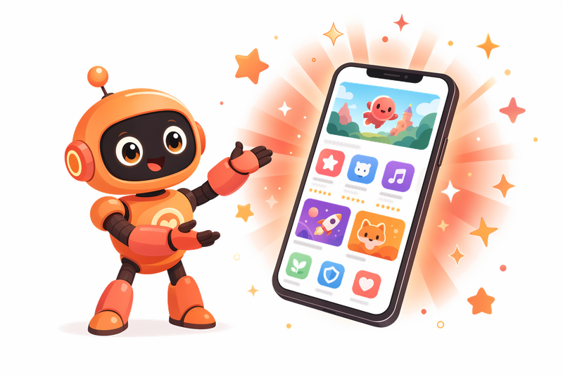
</p>

<h1 align="center">Shots</h1>

<p align="center">
  <strong>App Store screenshots that drive installs — powered by GPT-Image 2.</strong>
</p>

<p align="center">
  Type <code>/shots</code> in Claude Code. Paste your App Store URL to scrape your listing,<br>
  add your own app screenshots to <code>.shots/app-screenshots/</code>, drop design inspo<br>
  into <code>.shots/inspo/</code>, and get scroll-stopping App Store screenshots in minutes — not days.
</p>

## Install

Install the Shots skill to your AI coding agent:

```bash
# Install to your current project
npx skills add hypersocialinc/shots

# Install globally (available in all projects)
npx skills add hypersocialinc/shots --global

# Install to specific agents
npx skills add hypersocialinc/shots --agent claude-code cursor

# Install specific sub-skills only
npx skills add hypersocialinc/shots --skill shots --skill shots-revise
```

Works with Claude Code, Cursor, Codex, Cline, and [40+ other AI coding agents](https://github.com/vercel-labs/skills#supported-agents).

## Examples

<table>
  <tr>
    <td>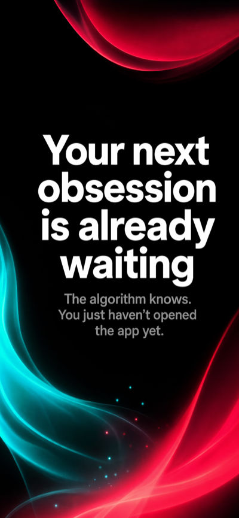</td>
    <td>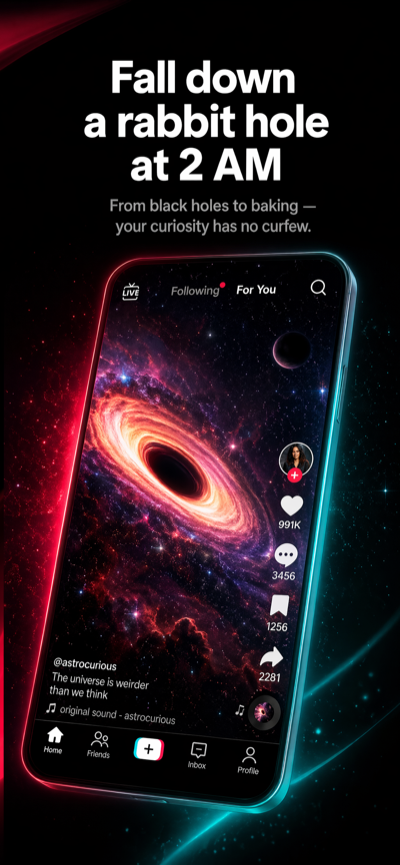</td>
    <td>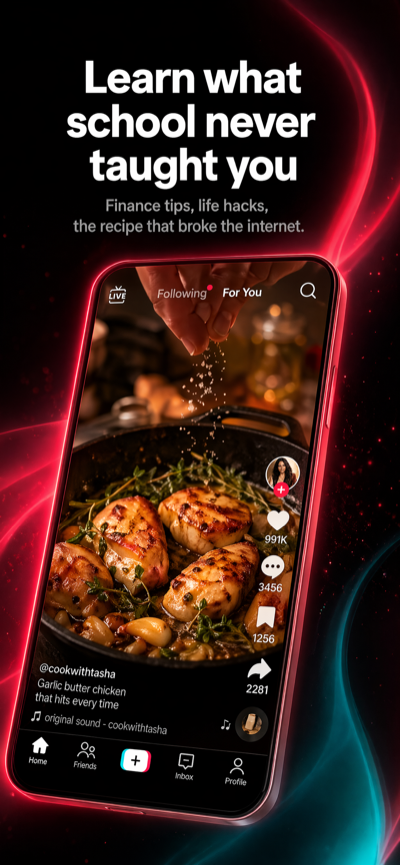</td>
  </tr>
  <tr>
    <td colspan="3"><em>TikTok — bold claims, scroll-stopping color</em></td>
  </tr>
  <tr>
    <td>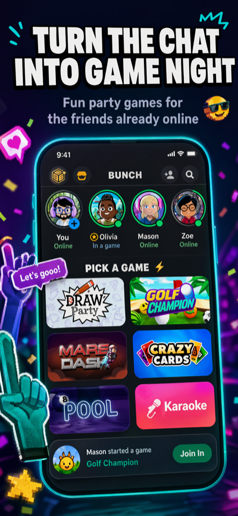</td>
    <td>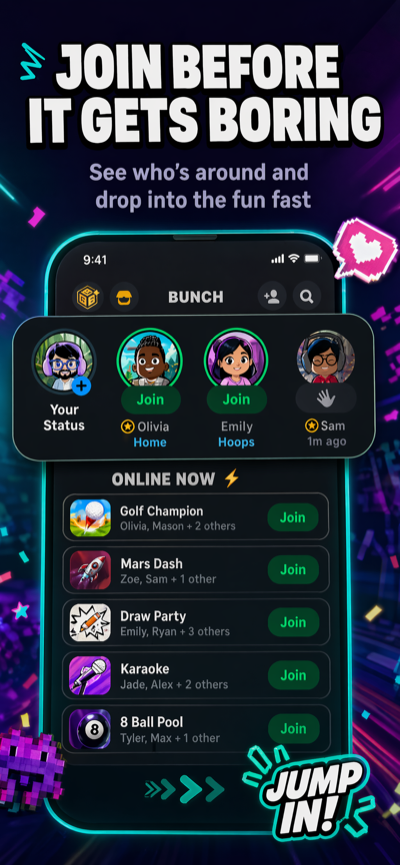</td>
    <td>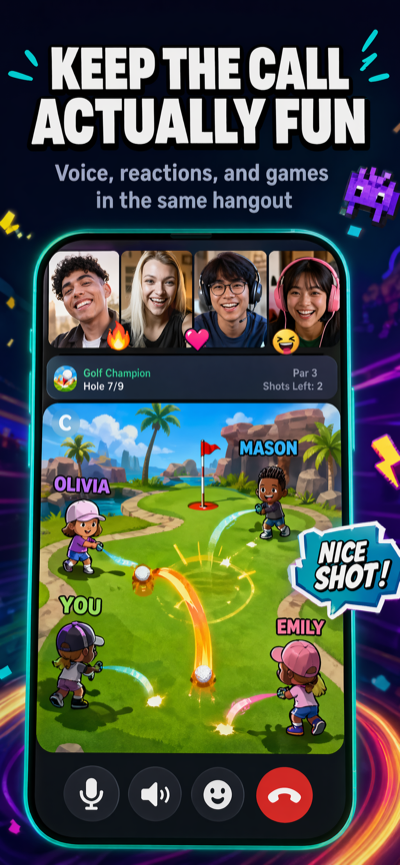</td>
  </tr>
  <tr>
    <td colspan="3"><em>Miniparty — playful identity, clear value props</em></td>
  </tr>
  <tr>
    <td>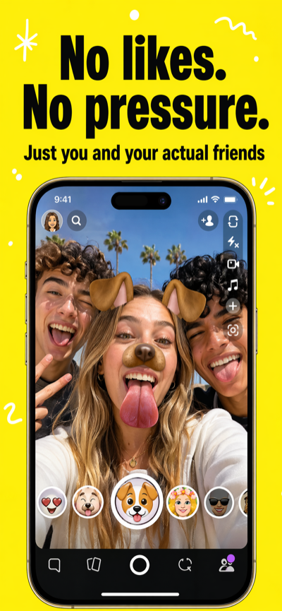</td>
    <td>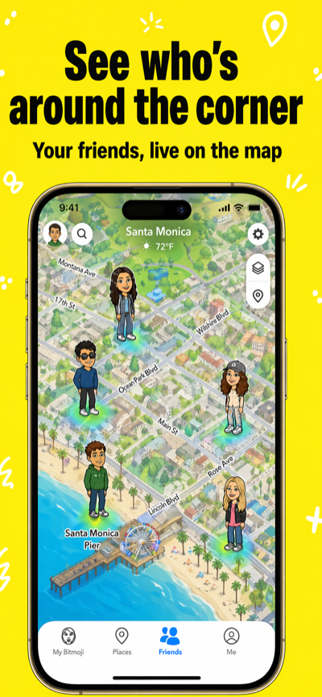</td>
    <td>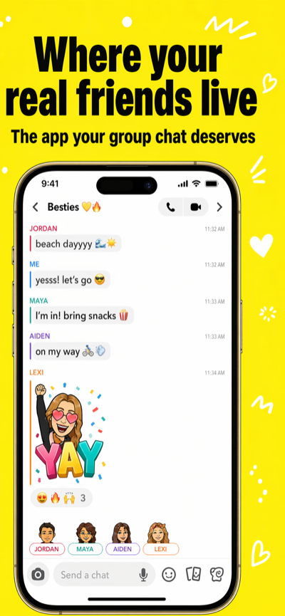</td>
  </tr>
  <tr>
    <td colspan="3"><em>Snapchat — high-energy visuals, benefit-first copy</em></td>
  </tr>
  <tr>
    <td>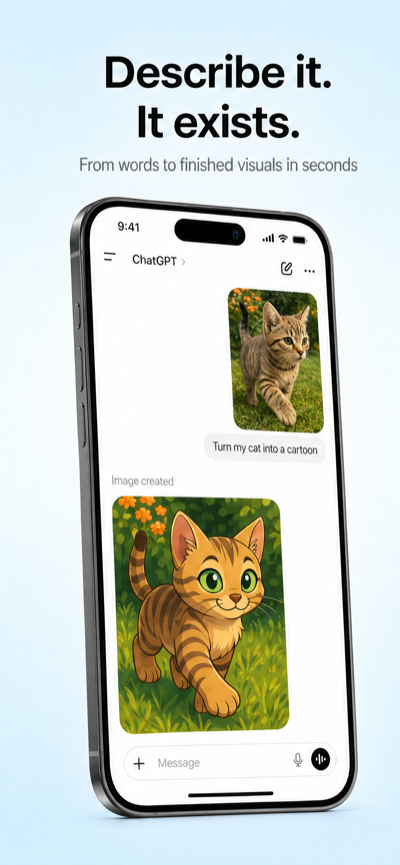</td>
    <td>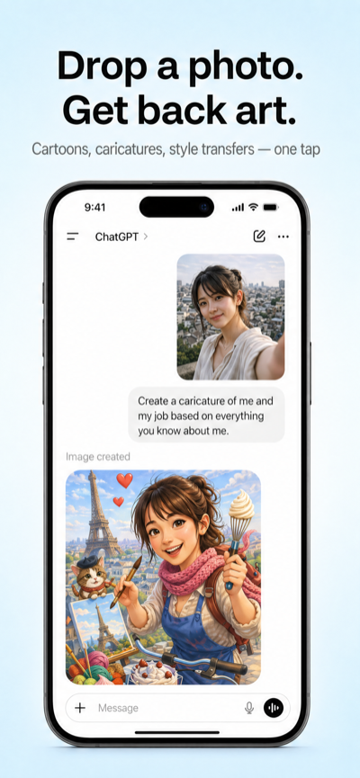</td>
    <td>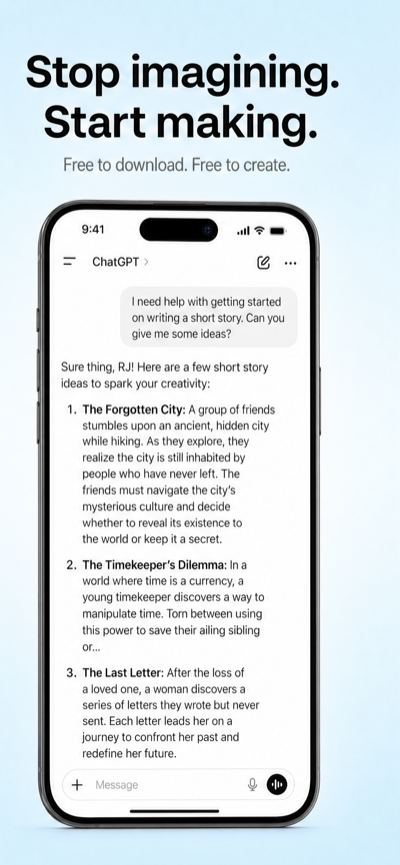</td>
  </tr>
  <tr>
    <td colspan="3"><em>ChatGPT — clean product tour, clear benefit headlines</em></td>
  </tr>
</table>

## Commands

| Command | What it does |
|---------|-------------|
| `/shots` | Full creation flow — workspace setup through final screenshots |
| `/shots-revise` | Iterate on existing shots with targeted feedback |
| `/shots-translate` | Localize shots for another language/locale |
| `/shots-scrape` | Scrape App Store metadata into config |
| `/shots-benefits` | Craft/refine benefit headlines without generating |

## How It Works

1. **Initialize** — set up a `.shots/` workspace in your project
2. **Research** — scrape your App Store listing, analyze your codebase
3. **Craft** — write benefit-driven headlines using proven copywriting frameworks
4. **Generate** — create wide composites via GPT-Image 2 (OpenAI or fal.ai)
5. **Crop** — split into individual App Store / Google Play panels
6. **Iterate** — revise with feedback, translate for other locales

## Requirements

- Node.js 18+
- `OPENAI_API_KEY` or `FAL_KEY`

## Project Structure

```
skills/shots/
  SKILL.md                # Main skill definition
  reference/              # Step-by-step agent instructions
  scripts/                # generate.mjs, crop.mjs, scrape.mjs
skills/shots-*/           # Sub-skills (revise, translate, scrape, benefits)
.shots/                   # Per-project workspace (created at runtime)
  config.json             # App metadata, benefits, brand colors
  runs/                   # Generated output (gitignored)
```
